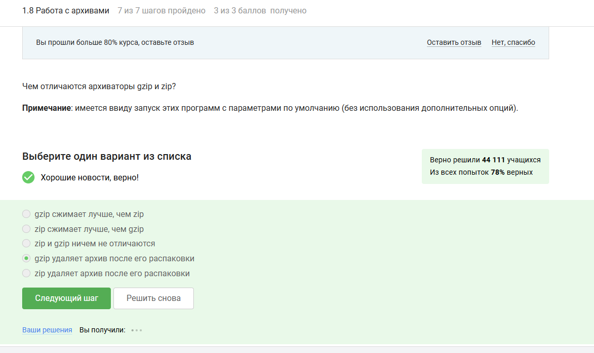

---
# Front matter
lang: ru-RU
title: "Отчёт по прохождению курса первый этап"
author: "Баранов Георгий"

# Formatting
toc-title: "Содержание"
toc: true # Table of contents
toc_depth: 2
lof: true # List of figures
fontsize: 12pt
linestretch: 1.5
papersize: a4paper
documentclass: scrreprt
polyglossia-lang: russian
polyglossia-otherlangs: english
mainfont: PT Serif
romanfont: PT Serif
sansfont: PT Sans
monofont: PT Mono
mainfontoptions: Ligatures=TeX
romanfontoptions: Ligatures=TeX
sansfontoptions: Ligatures=TeX,Scale=MatchLowercase
monofontoptions: Scale=MatchLowercase
indent: true
pdf-engine: lualatex
header-includes:
  - \linepenalty=10 # the penalty added to the badness of each line within a paragraph (no associated penalty node) Increasing the value makes tex try to have fewer lines in the paragraph.
  - \interlinepenalty=0 # value of the penalty (node) added after each line of a paragraph.
  - \hyphenpenalty=50 # the penalty for line breaking at an automatically inserted hyphen
  - \exhyphenpenalty=50 # the penalty for line breaking at an explicit hyphen
  - \binoppenalty=700 # the penalty for breaking a line at a binary operator
  - \relpenalty=500 # the penalty for breaking a line at a relation
  - \clubpenalty=150 # extra penalty for breaking after first line of a paragraph
  - \widowpenalty=150 # extra penalty for breaking before last line of a paragraph
  - \displaywidowpenalty=50 # extra penalty for breaking before last line before a display math
  - \brokenpenalty=100 # extra penalty for page breaking after a hyphenated line
  - \predisplaypenalty=10000 # penalty for breaking before a display
  - \postdisplaypenalty=0 # penalty for breaking after a display
  - \floatingpenalty = 20000 # penalty for splitting an insertion (can only be split footnote in standard LaTeX)
  - \raggedbottom # or \flushbottom
  - \usepackage{float} # keep figures where there are in the text
  - \floatplacement{figure}{H} # keep figures where there are in the text
---

# 1.1. Общая информация о курсе

{ #fig:001 width=70% height=70% }

{ #fig:002 width=70% height=70% }

# 1.2. Как установить линукс

{ #fig:003 width=70% height=70% }

{ #fig:004 width=70% height=70% }

{ #fig:005 width=70% height=70% }

# 1.3. Осваиваем линукс

{ #fig:006 width=70% height=70% }

{ #fig:007 width=70% height=70% }

{ #fig:008 width=70% height=70% }

{ #fig:009 width=70% height=70% }

# 1.4. Терминал основы

{ #fig:010 width=70% height=70% }

{ #fig:011 width=70% height=70% }

{ #fig:012 width=70% height=70% }

{ #fig:013 width=70% height=70% }

{ #fig:014 width=70% height=70% }

# 1.5. Запуск исполняемых файлов

{ #fig:015 width=70% height=70% }

{ #fig:016 width=70% height=70% }

{ #fig:017 width=70% height=70% }

# 1.6. Ввод вывод

{ #fig:018 width=70% height=70% }

{ #fig:019 width=70% height=70% }

{ #fig:020 width=70% height=70% }

# 1.7. Скачивание файлов из интернета

{ #fig:021 width=70% height=70% }

{ #fig:022 width=70% height=70% }

{ #fig:023 width=70% height=70% }

# 1.8. Работа с архивами

{ #fig:024 width=70% height=70% }

{ #fig:025 width=70% height=70% }

{ #fig:026 width=70% height=70% }

# 1.9. Поиск файлов и слов

{ #fig:027 width=70% height=70% }

{ #fig:028 width=70% height=70% }

{ #fig:029 width=70% height=70% }

