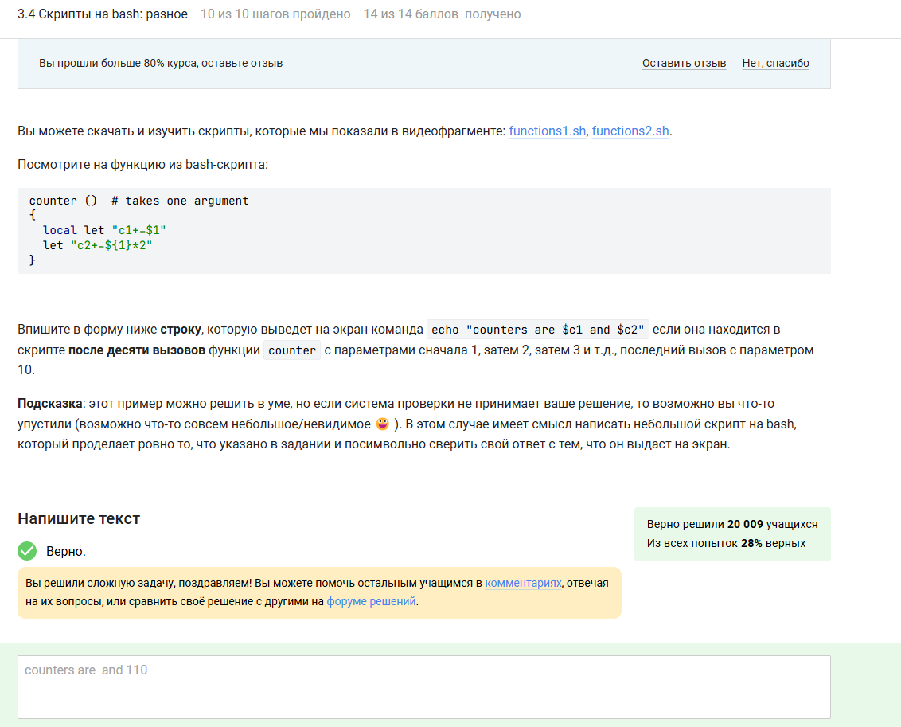

---
# Front matter
lang: ru-RU
title: "Отчёт по прохождению курса третий этап"
author: "Баранов Георгий"

# Formatting
toc-title: "Содержание"
toc: true # Table of contents
toc_depth: 2
lof: true # List of figures
fontsize: 12pt
linestretch: 1.5
papersize: a4paper
documentclass: scrreprt
polyglossia-lang: russian
polyglossia-otherlangs: english
mainfont: PT Serif
romanfont: PT Serif
sansfont: PT Sans
monofont: PT Mono
mainfontoptions: Ligatures=TeX
romanfontoptions: Ligatures=TeX
sansfontoptions: Ligatures=TeX,Scale=MatchLowercase
monofontoptions: Scale=MatchLowercase
indent: true
pdf-engine: lualatex
header-includes:
  - \linepenalty=10 # the penalty added to the badness of each line within a paragraph (no associated penalty node) Increasing the value makes tex try to have fewer lines in the paragraph.
  - \interlinepenalty=0 # value of the penalty (node) added after each line of a paragraph.
  - \hyphenpenalty=50 # the penalty for line breaking at an automatically inserted hyphen
  - \exhyphenpenalty=50 # the penalty for line breaking at an explicit hyphen
  - \binoppenalty=700 # the penalty for breaking a line at a binary operator
  - \relpenalty=500 # the penalty for breaking a line at a relation
  - \clubpenalty=150 # extra penalty for breaking after first line of a paragraph
  - \widowpenalty=150 # extra penalty for breaking before last line of a paragraph
  - \displaywidowpenalty=50 # extra penalty for breaking before last line before a display math
  - \brokenpenalty=100 # extra penalty for page breaking after a hyphenated line
  - \predisplaypenalty=10000 # penalty for breaking before a display
  - \postdisplaypenalty=0 # penalty for breaking after a display
  - \floatingpenalty = 20000 # penalty for splitting an insertion (can only be split footnote in standard LaTeX)
  - \raggedbottom # or \flushbottom
  - \usepackage{float} # keep figures where there are in the text
  - \floatplacement{figure}{H} # keep figures where there are in the text
---

# 3.1. Текстовый редактор вим

{ #fig:054 width=70% height=70% }

{ #fig:055 width=70% height=70% }

{ #fig:056 width=70% height=70% }

{ #fig:057 width=70% height=70% }

{ #fig:058 width=70% height=70% }

# 3.2. Скрипты на баш

{ #fig:059 width=70% height=70% }

{ #fig:060 width=70% height=70% }

{ #fig:061 width=70% height=70% }

{ #fig:062 width=70% height=70% }

# 3.3. Скрипты на баш ветвления циклы

{ #fig:063 width=70% height=70% }

{ #fig:064 width=70% height=70% }

{ #fig:065 width=70% height=70% }

{ #fig:066 width=70% height=70% }

{ #fig:067 width=70% height=70% }

# 3.4. Скрипты на баш разное

{ #fig:068 width=70% height=70% }

{ #fig:069 width=70% height=70% }

{ #fig:070 width=70% height=70% }

{ #fig:071 width=70% height=70% }

{ #fig:072 width=70% height=70% }

{ #fig:073 width=70% height=70% }

# 3.5. Продвинутый поиск и редактирование

{ #fig:074 width=70% height=70% }

{ #fig:075 width=70% height=70% }

{ #fig:076 width=70% height=70% }

{ #fig:077 width=70% height=70% }

{ #fig:078 width=70% height=70% }

{ #fig:079 width=70% height=70% }

{ #fig:080 width=70% height=70% }

# 3.6. Строим графики

{ #fig:081 width=70% height=70% }

{ #fig:082 width=70% height=70% }

{ #fig:083 width=70% height=70% }

{ #fig:084 width=70% height=70% }

# 3.7. Разное

{ #fig:085 width=70% height=70% }

{ #fig:086 width=70% height=70% }

{ #fig:087 width=70% height=70% }

{ #fig:088 width=70% height=70% }

{ #fig:089 width=70% height=70% }